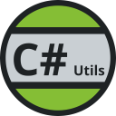

    
    <h1>C# Utilities</h1>

This extension adds utilitity commands and features that I found I needed when writting C# code in vscode.

- [Commands](#commands)
  - [Generate Assets from .sln](#generate-assets-from-sln)
- [Features](#features)
  - [New File Template](#new-file-template)

# Commands

## Generate Assets from .sln
It generates all launch.json and task.json for all the projects inside the solution file.
Rerun this if you update the sln it will only add the newly added projects.
If you dont have a sln file you can do `dotnet new sln`.
You can add them from the command line using `dotnet sln add path/to/*.csproj`.

# Features

## New File Template
When creating a new .cs file it automatically generates with a template containing a file scoped
namespace and a selection of `class`, `struct`, `interface`, `enum`, `abstract class`, `interface`
